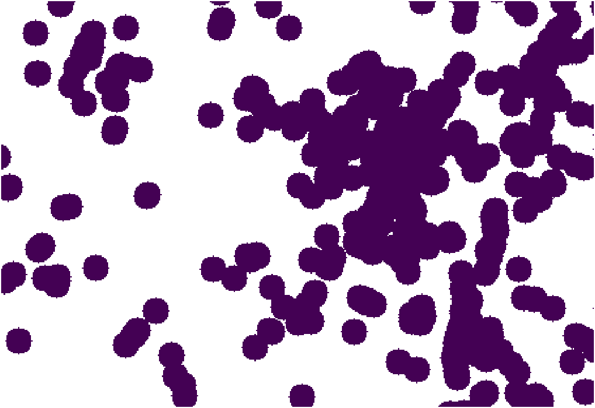
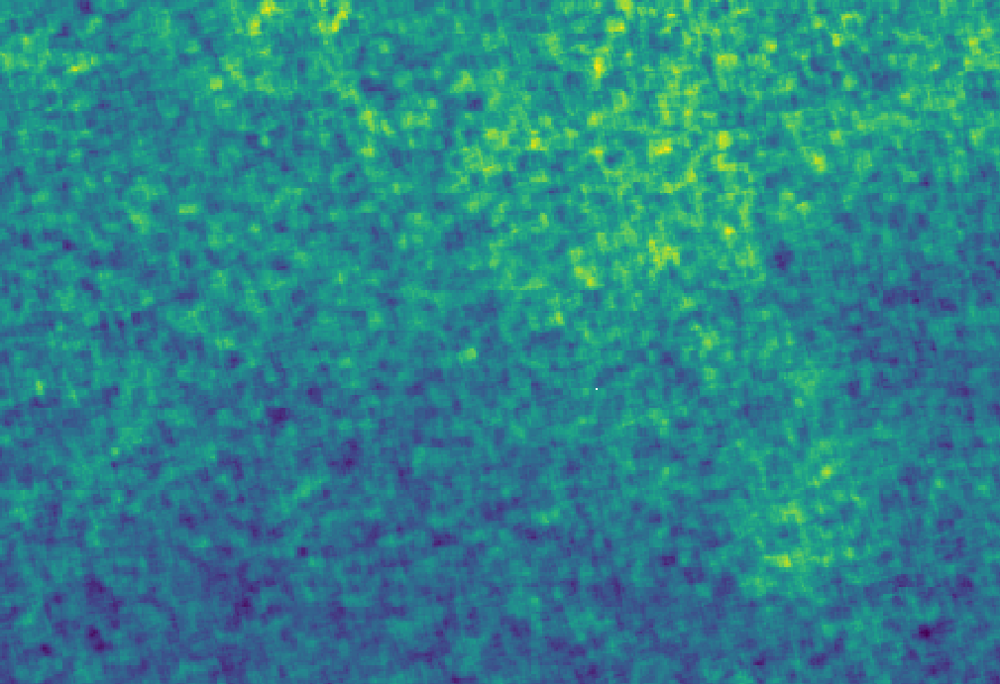
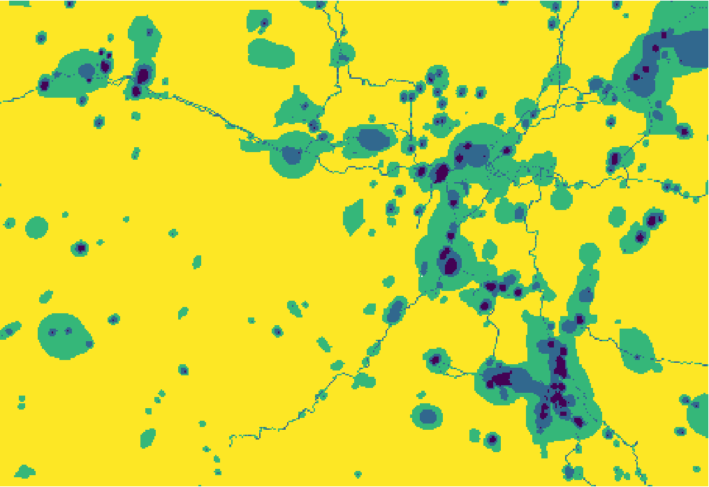
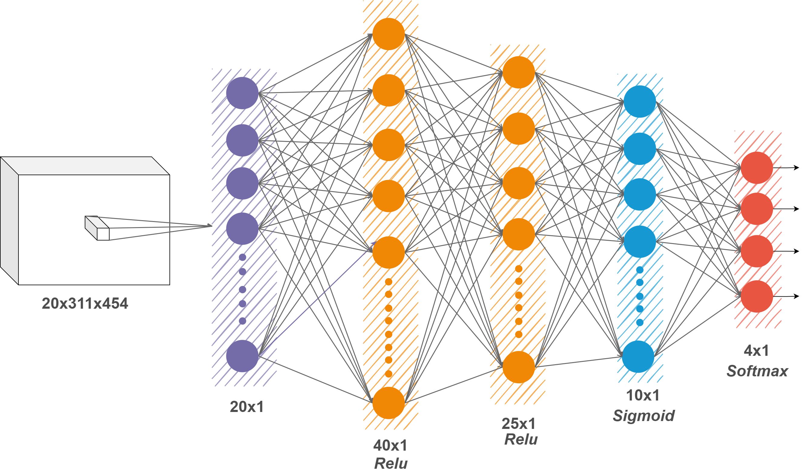

# MultiSpectral-RSImg-Classification
## `【武汉大学遥感学院】空间智能感知与服务课设 | 基于Softmax的多波段遥感影像分类`
## 1. 数据描述
>原始数据[FINAL.tif](./FINAL.tif)为tiff格式的多波段影像，共21个波段，其中第18个为Output波段即分类结果。经处理发现，共4种污染程度即4个类别，每个类别像素数量之间差距很大。具体数量如后所示`class_num:{1: 1092, 2: 6364, 3: 21599, 4: 112139}`

>数据存在大量Nan Inf干扰项，对实际预测判断没有用处，需进行去除。
### 波段1/2/19/18(Output)可视化结果
<div align="center">
      
</div>

## 2. 实验条件
`Pytorch` `Osgeo.gdal` `sklearn` `seaborn`

## 3. 网络模型
>由于数据结构较为简单，因此不引用任何开源网络架构，独立设计了一个简单的Softmax神经网络分割模型，经过多次失败的测试，最终设计得到的网络结构如下图所示，下面详细解释网络结构和设计的思路：
<div align="center">

</div>
                                          
> - **输入层**：采用考虑空间信息的卷积，则会产生大量的权重参数，但考虑到数据集数量较少，则很容易导致过拟合，因此只考率像素的波段信息，则输入层为20维张量。
> - **隐层**：为使得网络足够复杂以能够表达关系信息，共设置结点数分别为40/25/10的3层隐层，激活函数分别为*Relu/Relu/Sigmoid*，前两个*Relu*可以起到增加训练效率的作用。
> - **输出层和损失函数**：为像素级分类，即图像分割，输出层Softmax结构实现多分类，实际采用*log_softmax*，损失函数为负对数似然损失函数*NLLLoss*。公式如下: 
$$log\\_ softmax = \frac{e^{xi}}{\sum_{i}e^{xi}}~~~~NLLLoss = - \frac{1}{N}{\sum\limits_{k = 1}^{N}{y_{k}(log\\_ softmax)}}$$
> - **训练优化方法**：采用动态梯度下降法momentum，将一段时间内的梯度向量进行了加权平均，一定程度上消除了更新过程中的不确定性因素（如摆动现象），增加训练效率。

## 4.关键步骤
### 4.1 数据读取与清洗
>原始数据tiff无法用`OpenCV`或者`PIL`读取，使用`GDAL`读取原始数据转化为`ndarray`，并按照波段`reshape`为（20,141194）数据。利用`np.isinf`和`np.isnan`进行数据清洗，将无效数据替换为0或1。
### 4.2 样本划分与数据增强
>数据样本数量少且类别非常不均衡，因此采用简单的9:1随机进行训练集和验证集的划分。

>将训练集验证集的数据和标签转换为`pytorch.tensor`格式，同时注意数据必须为`float32`，标签必须为`long`，否则无法进行模型训练。
### 4.3	网络模型搭建
- 定义SoftMax网络
```
class Net(nn.Module):
    def __init__(self):
        super(Net, self).__init__()
        self.l1=nn.Linear(input_n,40)
        self.l2=nn.Linear(40,25)
        self.l3=nn.Linear(25,10)
        self.l4=nn.Linear(10,output_n)

    def forward(self,x):
        a1=F.relu(self.l1(x))
        a2=F.relu(self.l2(a1))
        a3=F.sigmoid(self.l3(a2))
        output=F.log_softmax(self.l4(a3), dim=1)
        return output
```
- 优化器与损失函数
```
#优化器随机梯度下降 momentum动态梯度下降
optimizer = torch.optim.SGD(model.parameters(), lr=lr,momentum=0.9)
#交叉熵损失
loss=nn.NLLLoss()
```
### 4.4 训练与验证
训练超参数设置如下，混淆矩阵可视化验证。
```
epochs=100#训练次数
lr=0.001#学习率
batch_size=256#批次大小
iteration=train_data.shape[0]//batch_size
```
## 5.结果评价
>由于训练数据进行了数据增强，因此合理的直接采用全部原始数据进行验证。
>最终计算得出的精度为***92.768%***
### 损失曲线和混淆矩阵
| 原始OutPut | 预测OutPut |
| --- | --- |
|||

